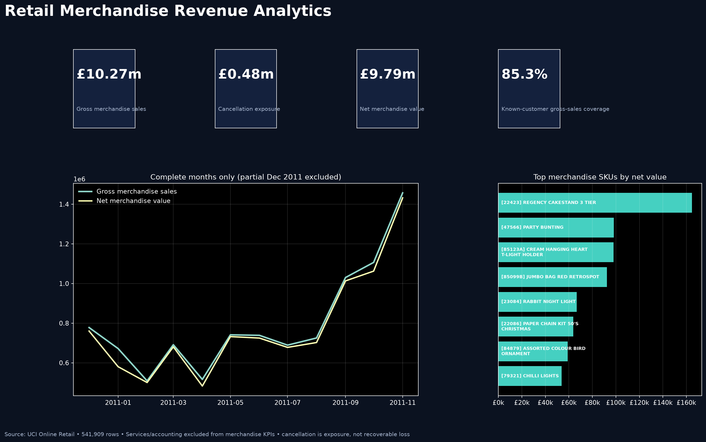

# Pavan Ramisetty

**Data Engineer | Databricks | Apache Spark | Delta Lakehouse | Cloud Data Platforms**

I am a Data Engineer with 5+ years of experience building governed batch and real-time data platforms using Databricks, Apache Spark, Python, and SQL across Azure, AWS, and GCP.

My experience includes Delta Lakehouse architecture, Spark Structured Streaming, Kafka, CDC, SCD Type 2, cloud migrations, data governance, CI/CD, production monitoring, and performance and cost optimization.

I am open to Data Engineer opportunities in the United States.

**Arkansas, United States** · [LinkedIn](https://www.linkedin.com/in/saipavan12/)

## What I bring

- **Data platform engineering:** build scalable, governed batch and streaming pipelines for analytics and AI/ML use cases
- **Lakehouse architecture:** design Delta Lakehouse workloads using Databricks, Apache Spark, Medallion Architecture, CDC, and SCD Type 2
- **Cloud engineering:** deliver data workflows across Azure, AWS, and GCP using services including ADLS, Event Hubs, Glue, Lambda, S3, GCS, and BigQuery
- **Reliability and performance:** improve pipeline monitoring, query performance, compute efficiency, and production troubleshooting
- **Data governance and delivery:** apply Unity Catalog, data-quality controls, CI/CD, approval gates, and environment-specific deployment practices

## Featured projects

### Retail Merchandise Revenue Analytics on Snowflake

A transaction-integrity and customer analytics project built from all 541,909 rows in the UCI Online Retail dataset, with Snowflake-oriented SQL and full local validation in DuckDB.

- Reconciled 541,909 source rows to 541,909 fact rows with no duplicate fact keys or required-dimension orphans
- Separated merchandise, service/accounting, and unresolved-review populations so postage, fees, bad debt, samples, and vouchers do not inflate merchandise KPIs
- Delivered tested dimensional models, cancellation-exposure analysis, product and country marts, purchase-only customer segmentation, reproducible acquisition, and a fail-closed Snowflake deployment plan

[View repository](https://github.com/PavanRMV/retail-revenue-analytics-snowflake)

### Ecommerce Growth Intelligence

An end-to-end GA4 ecommerce analytics project that turns public event data into tested BigQuery/dbt marts and four Tableau dashboards.

- Built an ordered shopping funnel, executive KPI layer, repeat-purchase cohorts, sample-window RFM segments, and product-performance analysis
- Kept three different purchase measures separate so stakeholders do not compare incompatible conversion rates
- Validated the repository with automated tests, SQL linting, independent KPI checks, provenance hashes, and explicit limitations

[View repository](https://github.com/PavanRMV/ecommerce-growth-intelligence) · [Open Tableau dashboards](https://public.tableau.com/views/Ecommerce_Growth_Intelligence/ExecutiveOverview?:showVizHome=no)

### US Hospital Readmission & Community Health Risk Intelligence

A healthcare analytics portfolio combining CMS hospital data with CDC community-health estimates for transparent readmission screening and benchmarking.

- Modeled 5,419 hospitals and 28,740 readmission rows while preserving measure-level context
- Built reproducible Python and SQLite pipelines, portable SQL analysis, generated reports, and a source-controlled Power BI project
- Surfaced missing data, ambiguous geographic joins, and denominator limitations instead of hiding them

[View repository](https://github.com/PavanRMV/healthcare-readmission-intelligence)

## Core toolkit

| Area | Tools and methods |
|---|---|
| Analytics | SQL, Python, pandas, exploratory analysis, KPI design |
| Data modeling | Snowflake, BigQuery, dbt, DuckDB, SQLite, dimensional modeling, grain contracts |
| Visualization | Power BI, DAX, Tableau, executive dashboards, data storytelling |
| Engineering | Git, GitHub, automated tests, CLI workflows, reproducible exports |
| Quality | Reconciliation, provenance, exception reporting, privacy-aware publication |

## How I work

I start with the decision a stakeholder needs to make, then define the data grain and metric rules before building a chart. I test the pipeline, reconcile important totals, and state where the evidence stops. The result should be useful to a business reader and reviewable by a technical team.

## Portfolio principles

- Clear business questions before tools
- Reproducible analysis instead of one-off screenshots
- Tested metrics instead of unexplained totals
- Direct findings with visible caveats
- Focused project scope instead of unnecessary tool sprawl
