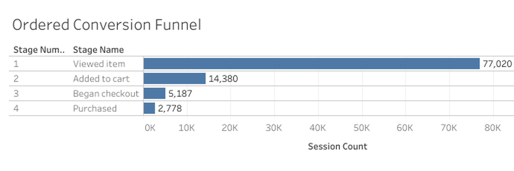
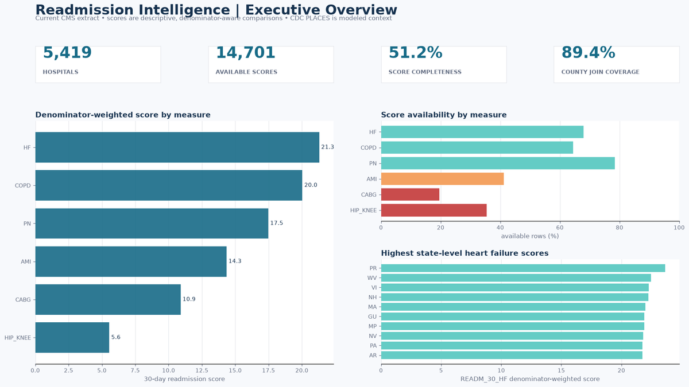

# Pavan Ramisetty

**Data Analyst | Business Intelligence | Analytics Engineering**

I turn complex, imperfect data into tested models, clear metrics, and dashboards that help business teams make decisions. My portfolio focuses on SQL, Python, Power BI, Tableau, BigQuery, and dbt, with an emphasis on reproducibility and honest interpretation.

I am open to Data Analyst and BI Analyst opportunities in the United States.

**Dallas, TX, USA** · [LinkedIn](https://www.linkedin.com/in/saipavan12/)

## What I bring

- **Business analysis:** translate broad questions into measurable KPIs, decision rules, and practical next steps
- **SQL and data modeling:** build grain-aware analytical models, reusable marts, reconciliation checks, and documented metric definitions
- **Python:** develop repeatable ingestion, cleaning, validation, analysis, and reporting workflows
- **Business intelligence:** design Power BI and Tableau dashboards for executives and operational teams
- **Data quality:** preserve exceptions, test assumptions, document limitations, and avoid claims the evidence cannot support

## Featured projects

### Ecommerce Growth Intelligence

An end-to-end GA4 ecommerce analytics project that turns public event data into tested BigQuery/dbt marts and four Tableau dashboards.

- Built an ordered shopping funnel, executive KPI layer, repeat-purchase cohorts, sample-window RFM segments, and product-performance analysis
- Kept three different purchase measures separate so stakeholders do not compare incompatible conversion rates
- Validated the repository with automated tests, SQL linting, independent KPI checks, provenance hashes, and explicit limitations

[View repository](https://github.com/PavanRMV/ecommerce-growth-intelligence) · [Open Tableau dashboards](https://public.tableau.com/views/Ecommerce_Growth_Intelligence/ExecutiveOverview?:showVizHome=no)

### US Hospital Readmission & Community Health Risk Intelligence

A healthcare analytics portfolio combining CMS hospital data with CDC community-health estimates for transparent readmission screening and benchmarking.

- Modeled 5,419 hospitals and 28,740 readmission rows while preserving measure-level context
- Built reproducible Python and SQLite pipelines, portable SQL analysis, generated reports, and a source-controlled Power BI project
- Surfaced missing data, ambiguous geographic joins, and denominator limitations instead of hiding them

[View repository](https://github.com/PavanRMV/healthcare-readmission-intelligence)

## Core toolkit

| Area | Tools and methods |
|---|---|
| Analytics | SQL, Python, pandas, exploratory analysis, KPI design |
| Data modeling | BigQuery, dbt, SQLite, dimensional modeling, grain contracts |
| Visualization | Power BI, DAX, Tableau, executive dashboards, data storytelling |
| Engineering | Git, GitHub, automated tests, CLI workflows, reproducible exports |
| Quality | Reconciliation, provenance, exception reporting, privacy-aware publication |

## How I work

I start with the decision a stakeholder needs to make, then define the data grain and metric rules before building a chart. I test the pipeline, reconcile important totals, and state where the evidence stops. The result should be useful to a business reader and reviewable by a technical team.

## Portfolio principles

- Clear business questions before tools
- Reproducible analysis instead of one-off screenshots
- Tested metrics instead of unexplained totals
- Direct findings with visible caveats
- Focused project scope instead of unnecessary tool sprawl
